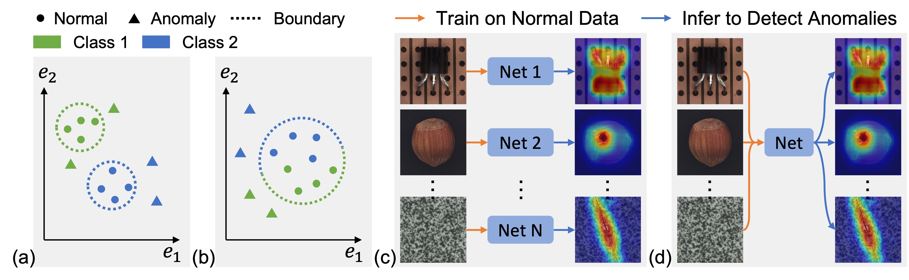

# UniAD
Official PyTorch Implementation of [A Unified Model for Multi-class Anomaly Detection](https://arxiv.org/abs/2206.03687), Accepted by NeurIPS 2022.




## 1. Quick Start

### 1.1 MVTec-AD

- **Create the MVTec-AD dataset directory**. Download the MVTec-AD dataset from [here](https://www.mvtec.com/company/research/datasets/mvtec-ad). Unzip the file and move some to `./data/MVTec-AD/`. The MVTec-AD dataset directory should be as follows. 

```
|-- data
    |-- MVTec-AD
        |-- mvtec_anomaly_detection
        |-- json_vis_decoder
        |-- train.json
        |-- test.json
```

- **cd the experiment directory** by running `cd ./experiments/MVTec-AD/`. 

- **Train or test** by running: 

    (1) For slurm group:  `sh train.sh #NUM_GPUS #PARTITION` or `sh test.sh #NUM_GPUS #PARTITION`.

    (2) For torch.distributed.launch:  `sh train_torch.sh #NUM_GPUS` or `sh test_torch.sh #NUM_GPUS`.

    **Note**: During test, please *set config.saver.load_path* to load the checkpoints. 

- **Results and checkpoints**. Training on 8 GPUs (NVIDIA Tesla V100 16GB) results in following performance.

| Detection AUROC | Localization AUROC | Checkpoints |
| ------ | ------ | ------ |
|  96.7 | 96.8 | [here](https://drive.google.com/file/d/1q03ysv_5VJATlDN-A-c9zvcTuyEeaQHG/view?usp=sharing) |

### 1.2 CIFAR-10

- [ ] TODO

## 2. Visualize Reconstructed Features

We **highly recommend** to visualize reconstructed features, since this could directly prove that our UniAD *reconstructs anomalies to their corresponding normal samples*. 

### 2.1 Train Decoders for Visualization

- **cd the experiment directory** by running `cd ./experiments/train_vis_decoder/`. 

- **Train** by running: 

    (1) For slurm group:  `sh train.sh #NUM_GPUS #PARTITION`.

    (2) For torch.distributed.launch: `sh train_torch.sh #NUM_GPUS #CLASS_NAME`.

    **Note**: for torch.distributed.launch, you should *train one vis_decoder for a specific class for one time*. 

### 2.2 Visualize Reconstructed Features

- **cd the experiment directory** by running `cd ./experiments/vis_recon/`. 

- **Visualize** by running (only support 1 GPU): 

    (1) For slurm group:  `sh vis_recon.sh 1 #PARTITION`.

    (2) For torch.distributed.launch:  `sh vis_recon_torch.sh 1 #CLASS_NAME`.

    **Note**: for torch.distributed.launch, you should *visualize a specific class for one time*. 
